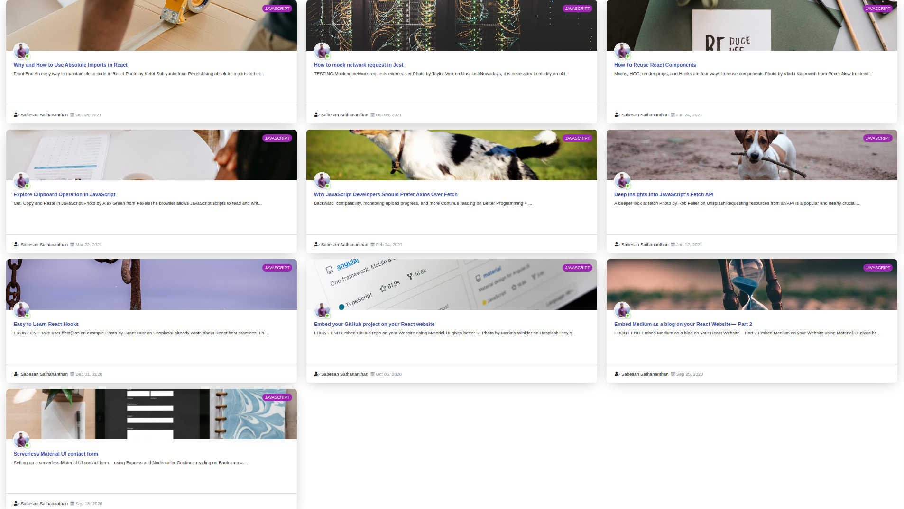

<h1 align='center'>Material UI Medium Blog</h1>

<p align="center">
Aim of this Project is embed Medium as a blog on your React website with an active status badge (green badge) for a time period .
</p>



<p align="center">
<a href="https://github.com/sabesansathananthan/material-ui-medium-blog/blob/master/.github/LICENSE">
      
    </a><a href="https://github.com/sabesansathananthan/material-ui-medium-blog">
      
    </a><a href="https://github.com/sabesansathananthan/material-ui-medium-blog">
      
    </a><a href="https://twitter.com/intent/tweet?text=Wow,%20I%20used%20material-ui-medium-blog.%20That%20is%20excellent.%20Thank%20you%20@TheSabesan">
      
    </a>
</p>

## 🛠️ Built with

- [React JS](https://reactjs.org/) - Front-End JavaScript library
- [Material UI](https://material-ui.com/) - React UI Framework

## Installation

To setup the app for development on your local machine, please follow the instructions below:

1. Clone the repo to your machine

   ```bash
   git clone https://github.com/sabesansathananthan/material-ui-medium-blog.git
   cd material-ui-medium-blog
   ```

2. Install packages

   If you use `npm`

   ```bash
   npm install
   ```

   or

   If you use `yarn`

   ```bash
   yarn
   ```

3. Change username

   Use your Medium username👤 instead of `@Sabesan96`. in [Slider.js](./src/components/Slider.js)

   ```JavaScript
   mediumURL = "https://api.rss2json.com/v1/api.json?rss_url=https://medium.com/feed/@Sabesan96";
   ```

4. Change active hours
   Active hours set as morning 5.00 am to night 8.00 pm. You could change the active hours in [PostCard.js](./src/Components/PostCard.js). If your time zone is not Indian          Standard Time IST Change the ISTOffset value.<br>
   Calculation for Finding Offset <br>
   For me it is IST. Therefore, +5:30. <br>
   Offset = +5 x 60 + 30

   ```JavaScript
   const ISTOffset = 330; // IST offset UTC +5:30 🕠
   const isOnline = ISTTime.getHours() >= 5 && ISTTime.getHours() <= 20;
   ```

5. Run the development server

   If you use `npm`

   ```bash
   npm start
   ```

   or

   If you use `yarn`

   ```bash
   yarn start
   ```

6. Visit <http://localhost:3000>

## [Live Demo](https://material-ui-medium-blog.vercel.app/)

Don't forget to give a star :star: for this repo :slightly_smiling_face:

##  Related Article

[Embed Medium as a blog on your React Website — Part 2](https://medium.com/datadriveninvestor/embed-medium-as-a-blog-on-your-react-website-part-2-187db2b60a59) - _Sabesan Sathananthan_

## Similar Projects

- [React-Medium-Blog](https://github.com/sabesansathananthan/React-Medium-Blog)
- [React-Dev.to-Blog](https://github.com/sabesansathananthan/react-dev.to-blog)

## 📄 License

This project is licensed under the MIT License - see the [LICENSE](./.github/LICENSE) file for details
